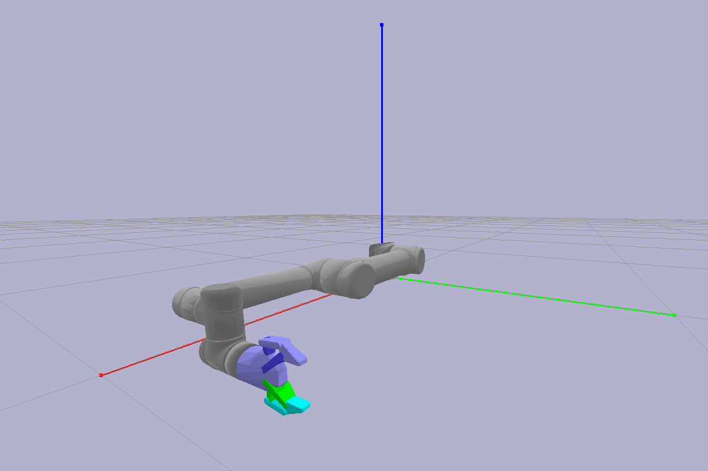

# CoSTAR Planner

[](https://travis-ci.com/cpaxton/costar_plan)

The CoSTAR Planner is part of the larger [CoSTAR project](https://github.com/cpaxton/costar_stack/). It integrates some learning from demonstration and task planning capabilities into the larger CoSTAR framework in different ways..

Specifically it is a project for creating task and motion planning algorithms that use machine learning to solve challenging problems in a variety of domains. This code provides a testbed for complex task and motion planning search algorithms. The goal is to describe example problems where actor must move around in the world and plan complex interactions with other actors or the environment that correspond to high-level symbolic states.

To run these examples, you will need TensorFlow and Keras, plus a number of Python packages. If you want to stick to the toy examples, you do not need to use this as a ROS package.

For some more information on the structure of the task planner package, check out the [design overview](docs/design.md).

## Installation

TTS can be installed either as a ROS catkin package or as an independent python package. Most features will work just fine if it is used without ROS.

  - To install TTS as a ROS package, just `git clone` it into your catkin workspace, build, re-source, and start running scripts.
  - To install TTS as an independent python package, use the `setup.py` file in the `python` directory.

To install the python packages on which TTS depends:
```
pip install h5py Theano pygame sympy matplotlib pygame gmr networkx dtw pypr gym
```

This includes:
  - [OpenAI Gym](https://github.com/openai/gym) -- note that you can install from `pip` as well, TTS defines its own gym environments. You do not need any of the environments, so this is best installed via `pip`.

Other Required Libraries:
  - [TensorFlow](https://www.tensorflow.org/)
  - [Keras 1.1.2](https://github.com/fchollet/keras)
  - [Keras-RL](https://github.com/matthiasplappert/keras-rl/) -- it may be useful to look at [my fork](https://github.com/cpaxton/keras-rl) if you run into any issues.

**[For developers]** Libraries referenced, but not needed as prerequisites:
  - [Tensorflow-Reinforce](https://github.com/yukezhu/tensorflow-reinforce)
  - [Guided Policy Search](https://github.com/cbfinn/gps) - `traj_opt` directly included
  - [KeRLym](https://github.com/osh/kerlym) - referenced during `Trainer` implementation

## Problem Domains

  - Robotics: mimic an expert task performance in a new environment.
  - Grid World: navigate a busy road in a discrete grid task.
  - Needle Master: steer a needle through a sequence of gates while avoiding obstacles. In many ways this is a simplified driving problem, with an associated set of demonstrations.

### Robotics

These examples are designed to work with ROS and a simulation of the Universal Robots UR5, KUKA LBR iiwa, or other robot. ***NOTE THAT THIS FUNCTIONALITY IS STILL IN DEVELOPMENT.***



Our examples are based around the `costar_bullet` package, which uses the open-source Bullet simulator. To start, simply run:
```
rosrun costar_bullet start
```

You can run this with the `-h` or `--help` flag to get a list of potential arguments. The `start` command can be configured to bring up a robot and a task. For example, you may want to run:
```
rosrun costar_bullet start --robot ur5_robotiq --task blocks --gui
```
To bring up the standard CoSTAR UR5 with Robotiq 85 gripper, a block-stacking task, and a basic Bullet GUI to see things.

### Grid World

[](https://youtu.be/LLs1OIIIQnw)

Grid world is an ultra-simple driving task. The actor must move around a grid and navigate an intersection. Note that as the first domain implemented, this does not fully support the TTS API.

#### Run

```
create_training_data.py
learn_simple.py
```

### Needle Master

[](https://youtu.be/GgIznhbk-5g)

Example from a simple Android game. This comes with a dataset that can be used; the goal is to generate task and motion plans that align with the expert training data.

One sub-task from the Needle Master domain is trajectory optimization. The goal is to generate an optimal trajectory in the shortest possible amount of time.

## Contact

This code is maintained by Chris Paxton (cpaxton@jhu.edu).

## Known Issues

TTS is currently under development. This section will document missing features, bugs, or short-term implementation decisions that may influence the behavior of this code and its examples.

Missing components and features:

  - NeedleMaster conditions are wrong
  - NeedleMaster needs predicates to be implemented
  - NeedleMaster cost function is missing
  - Specify options `{Approach, Pass-Through, Connect, Exit}` for Needle Master.
  - Robotics examples:
    - TOM
    - CoSTAR UR5
  - Missing/incomplete trainers:
    - Implementation of REINFORCE for recurrent nets
    - Implementation of REINFORCE for continuous action spaces
    - Guided Policy Search
  - Robotics examples:
    - Possibly fit neural nets or other models for these policies
    - JointStateListener needs to prune unused joint states
    - GMM policy can be fit based on data
    - Feature function based on relative position and orientation to objects
    - Demonstration reward function
  - MCTS:
    - continuous RAVE
    - kernel regression
    - double progressive widening


