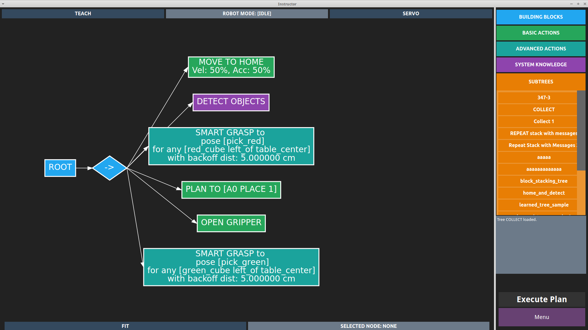

# Real Robot Experiments with CoSTAR

This code requires the latest version of the open source [CoSTAR stack](git@github.com:cpaxton/costar_stack.git).

## Starting Real Robot

Just run:
```
roslaunch ctp_integration bringup.launch
```

This is configured specifically to work with the JHU UR5, and may not work (or may require some adaptation) if you want to use it with a different robot.

Optionally, you can start the instructor UI to make it easier to set up tasks. This command is:
```
roslaunch instructor_core instructor.launch
```

The CoSTAR UI is designed to make data collection and specifying simple tasks easier. If you want to put the robot in freedrive mode, press "TEACH" at the top of the UI.



You can use the UI to construct simple task plans and save them as Behavior Trees, and to control robot functionality.

## Run Data Collection

The command for data collection is:
```
rosrun ctp_integration run.py
```

For example, to start collection for 100 samples:
```
# Use the --execute flag to loop for a certain number of trials
rosrun ctp_integration run.py --execute 100
```

To restart partway through:
```
# Start at example number 38
rosrun ctp_integration run.py --execute 100 --start 38
```

### About the Data Collection Tool

Data collection will call the `update()` function after every action, which saves the current joint states, servos the arm out of the way, and updates scene information before returning the arm to its original position.

The data collection tool by default saves `.h5f` files to the `$HOME/.costar/data` directory, though you may want to change this. It will save a number of different fields:

```
# Field and shape of output for a trial lasting 141 frames = 14.1 seconds
('info', (141,))
('object', (141,))
('image', (141,))
('pose', (141, 7))
('label', (141,))
('q', (141, 6))
('camera', (141, 7))
('labels_to_name', (40,))
('object_pose', (141, 7))
('dq', (141, 6))
```

These are:
  - `info`: string description of which stage of SmartMove (high-level action) the robot is in
  - `object`: unique object ID, assigned via perception system
  - `image`: compressed image (JPEG encoding)
  - `pose`: x,y,z + quaternion, end effector pose relative to robot base
  - `label`: integer index into action labels list
  - `q`: current joint positions
  - `camera`: x,y,z, + quaternion, camera pose relative to robot base
  - `labels_to_name`: list of strings for action name
  - `object_pose`: x,y,z + quaternion, pose of object being manipulated if possible
  - `dq`: current joint velocities

As of March 14, 2018, the list of actions in `labels_to_name` returns:
```
['place_green_on_yellow', 'place_yellow_on_greenblue',
 'place_blue_on_yellowred', 'place_yellow_on_red', 'place_blue_on_red',
 'grab_blue', 'place_red_on_blueyellow', 'place_green_on_redyellow',
 'place_red_on_yellow', 'place_green_on_blueyellow', 'place_red_on_greenblue',
 'place_blue_on_green', 'place_blue_on_redgreen', 'place_yellow_on_blue',
 'place_blue_on_greenyellow', 'place_blue_on_yellowgreen',
 'place_blue_on_greenred', 'place_yellow_on_redgreen', 'grab_yellow',
 'place_red_on_greenyellow', 'grab_green', 'place_red_on_green',
 'place_yellow_on_bluered', 'place_yellow_on_green', 'place_green_on_blue',
 'place_yellow_on_bluegreen', 'place_blue_on_redyellow', 'place_red_on_blue',
 'place_red_on_yellowgreen', 'place_yellow_on_greenred',
 'place_green_on_yellowblue', 'place_red_on_bluegreen', 'place_green_on_red',
 'place_red_on_yellowblue', 'place_green_on_yellowred',
 'place_green_on_redblue', 'grab_red', 'place_yellow_on_redblue',
 'place_green_on_bluered', 'place_blue_on_yellow']
```

## Debugging

### Debugging CoSTAR Arm

The `CostarArm` class manages activity like the SmartMoves we use to manipulate objects.

You can just kill the UR5 server script and restart it with:
```
rosnode kill /simple_ur5_driver_node
rosrun costar_robot_manager ur_driver.py
```

This can be useful if you want to debug any particular aspect of the Arm, such as the SmartMoves.
