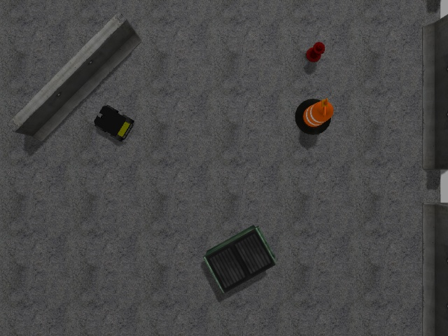

# Husky Simulation



This example provides instructions on bringing up the husky robot simulation for data collection.

## Start Simulation

```
rosrun costar_simulation start --launch husky --experiment navigation
rosrun costar_simulation husky_test_data_write.py
```

### Remote Control

You can also get an interactive command prompt which lets you send orders to the robot as to which objects it should find. This can be useful if you want to see what the task actually looks like.

```
rosrun costar_simulation start --launch husky --experiment navigation
rosrun costar_simulation husky_test.py
```

Then you can enter one of:
  - Barrel
  - Fire Hydrant
  - Barrier
  - Dumpster

## Old Simulation Version

This is basically the same as the above, but without the addition of the `costar_simulation` wrapper for easy bringup.

To start the Husky demo the old way:

```
roslaunch husky_gazebo husky_playpen.launch
roslaunch husky_viz view_robot.launch
roslaunch husky_navigation exploration_demo.launch
rosrun costar_simulation husky_test.py
```
