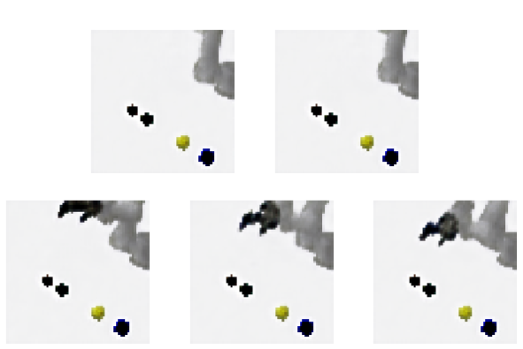

# Machine Learning 

CTP implements a number of machine learning algorithms that can be used in different ways.

## Getting Started

General procedure:
  - create a dataset or run an RL algorithm
  - fit a model
  - test

### Creating a Dataset

We need some data to work with. Let's start by making a small data set using both joint data and RGB images.

```
rosrun costar_bullet start --robot ur5 --task blocks --agent task \
  --features multi --save -i 10 --data_file small.npz
```

When we want to create a bigger data set, we can do so easily with:
```
rosrun costar_bullet start --robot ur5 --task blocks --agent task \
  --features multi --save -i 100 --data_file big.npz
```

This second one will include 100 trials of the robot picking and placing random blocks, as per the "blocks" task.

So, what do these arguments mean?
  - `save` tells us we should save a dataset
  - `--features multi` says we should use both camera input, arm joint state, and gripper state
  - `--robot ur5` says we should use the UR5 with 2-finger robotiq gripper
  - `--task blocks` says we are interested in performing the blocks task
  - `--agent task` says we want an "expert" task model to generate data rather than a human or RL algorithm
  - `-i 10` says we want to run for 10 iterations, i.e. on 10 different random environments

### Learning a Policy with Behavioral Cloning

The most straightforward approach we can take to getting a robot that will act on our environment is behavioral cloning. As long as we have a Task Agent that can generate decent policies, this is a reasonable starting point.

To fit such a model, run:
```
rosrun costar_bullet start --robot ur5 --agent null --features multi --load \
  --model ff_regression --si 5 -i 1000  --batch_size 64 --data_file big.npz
```

To try it out, run:
```
rosrun costar_bullet start --robot ur5 --task blocks --agent ff \
  --features multi -i 1000 --model ff_regression --gui 
```

We need to separately define the specific architector (`ff_regression`) and the agent to execute (`ff`).

### Learning a Convolutional Autoencoder

This is a simple approach; we're going to directly fit an input to an output image.
```
rosrun costar_bullet start --robot ur5 --agent null --features multi --load \
  --model autoencoder --data_file small.npz --si 5 -i 1000  --batch_size 64
```



Above is an example of what this might look like after about 300 iterations. That's not very long, but we can still clearly see the robot's shape, and the net is starting to learn about block color.


### Learning a Generative Adversarial Network

GANs are a popular approach these days, and luckily it's pretty easy to train one with CTP:
```
rosrun costar_bullet start --robot ur5 --agent null --features multi --load \
  --model gan --data_file small.npz --si 5 -i 1000  --batch_size 64 \
  --optimizer nadam --lr 0.001
```

This will load our small data set and run for 1000 iterationsm using the ADAM optimizer with Nesterov momentum. Go ahead and play with the settings.

## References

### Libraries Referenced

These are software libraries that might be worth a look.

**[For developers]** Libraries referenced, but not needed as prerequisites:
  - [Tensorflow-Reinforce](https://github.com/yukezhu/tensorflow-reinforce)
  - [Guided Policy Search](https://github.com/cbfinn/gps) - `traj_opt` directly included
  - [KeRLym](https://github.com/osh/kerlym) - referenced during `Trainer` implementation

### Papers

TODO
