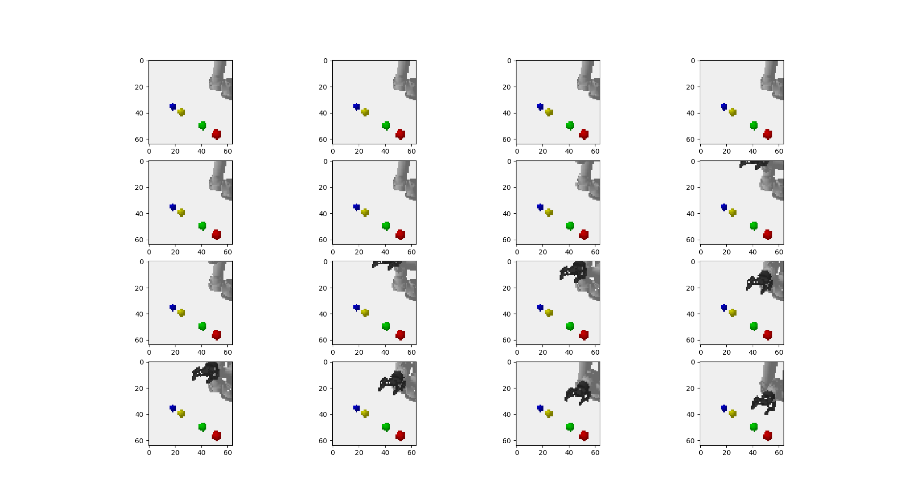
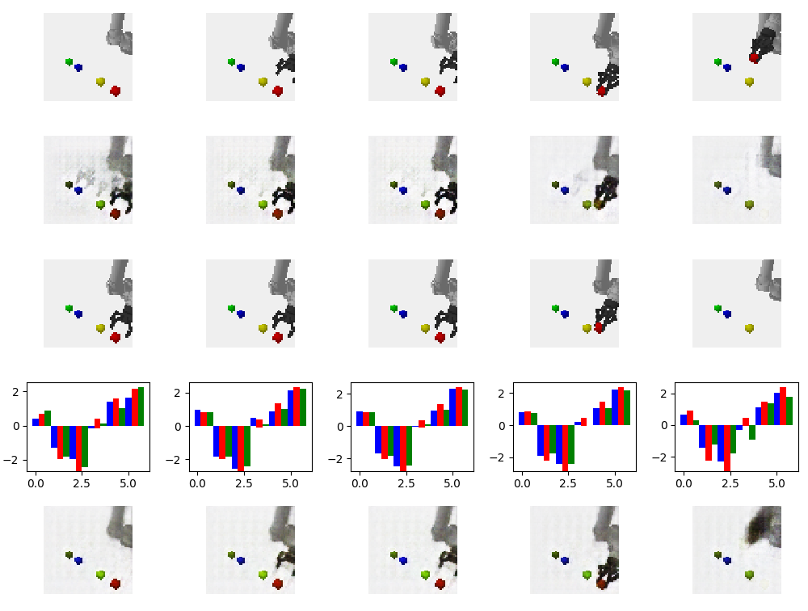

# Task Learning

The goal of our hierarchical task learning is to be able to use symbolic high-level planning grounded by learned neural net models of the world.

Our training data is sequences of task execution created with the `costar_bullet` simulation tool, as per the figure below.



The tool lets us generate large amounts of task performances, with randomized high level (and eventually low level) actions.

**ABOUT THIS DOCUMENT:** This mostly consists of notes by Chris Paxton for how to get these methods to work. Some of these notes will be good; some may be out of date.

## Task Definition

The task is defined as a set of high- and low-level actions at various levels, given by a task plan such as that shown below. For now, we will consider the simple version of the "blocks" task.

Here, the robot can grab one of several blocks. Grabbing a block is divided between aligning, approaching, and closing the gripper. We wish to define a task architecture like this one:


The code below defines this simplest version of the task, creating both the action generators themselves (called "options"), and associated conditions. There are three differnt things we need to create:
  - options: these are the high-level actions; each one is a "generator" from which we can sample different policies and termination conditions.
  - arguments: these contain an option constructor, arguments, and an optional field to remap from these arguments to a part of the option constructor.
  - task: the task model itself.

The key parts of the Option are the constructor and the `samplePolicy(world)` function, which takes a current world and returns a policy functor and a condition.

The block of code below, taken from [CTP's Blocks task](../costar_task_plan/python/costar_task_plan/simulation/tasks/blocks.py), defines the choice between different objects. Take a look at the [basic simulation options](../costar_task_plan/python/costar_task_plan/simulation/option.py) for examples of options and the `samplePolicy()` function.

``` python
AlignOption = lambda goal: GoalDirectedMotionOption(
    self.world,
    goal,
    pose=((0.05, 0, 0.05), self.grasp_q),
    pose_tolerance=(0.03, 0.025),
    joint_velocity_tolerance=0.05,)
align_args = {
    "constructor": AlignOption,
    "args": ["block"],
    "remap": {"block": "goal"},
}
GraspOption = lambda goal: GoalDirectedMotionOption(
    self.world,
    goal,
    pose=((0.0, 0, 0.0), self.grasp_q),
    pose_tolerance=(0.03, 0.025),
    joint_velocity_tolerance=0.05,)
grasp_args = {
    "constructor": GraspOption,
    "args": ["block"],
    "remap": {"block": "goal"},
}
LiftOption = lambda: GeneralMotionOption(
    pose=(self.over_final_stack_pos, self.grasp_q),
    pose_tolerance=(0.05, 0.025),
    joint_velocity_tolerance=0.05,)
lift_args = {
    "constructor": LiftOption,
    "args": []
}
PlaceOption = lambda: GeneralMotionOption(
    pose=(self.final_stack_pos, self.grasp_q),
    pose_tolerance=(0.05, 0.025),
    joint_velocity_tolerance=0.05,)
place_args = {
    "constructor": PlaceOption,
    "args": []
}
close_gripper_args = {
    "constructor": CloseGripperOption,
    "args": []
}
open_gripper_args = {
    "constructor": OpenGripperOption,
    "args": []
}
```

When we create a task model, we use the `add(name, parent, arg_dict)` function. Its three parameters are:
  - `name`: name of the option
  - `parent`: name of the predecessor, or `None` if predecessor is root
  - `arg_dict`: dictionary containing constructor function, list of argument names, and optionally a `remap` dictionary from argument names to option constructor parameters.

```
# Create a task model
task = Task()
task.add("align", None, align_args)
task.add("grasp", "align", grasp_args)
task.add("close_gripper", "grasp", close_gripper_args)
task.add("lift", "close_gripper", lift_args)
task.add("place", "lift", place_args)
task.add("open_gripper", "place", open_gripper_args)
task.add("done", "open_gripper", lift_args)
```

We automatically call the `task.compile()` function to create the task model.

# Creating a Data Set

You can create a small data set in the normal way:

```
rosrun costar_bullet start --robot ur5 --task stack1 --agent task \
  --features multi --save -i 10 --data_file small.npz --success_only
```

It might be helpful to make a larger training data set than this one, which is possible by changing the number of iterations as seen below.

```
rosrun costar_bullet start --robot ur5 --task stack1 --agent task \
  --features multi --save -i 100 --data_file bigger.npz --success_only
```

Some notes:
  - For learning from demonstration, the `--success_only` flag will make your life easier by preventing it from saving failed demonstrations.
  - `--task stack1` will generate a slightly more complex and more interesting task than `--task blocks`.
  - You can use the `--fast_reset` flag to quickly visualize and debug tasks, but PyBullet seems unstable over long data collection runs with this flag on.

## Current Best Practice

Create some data for predictor learning, 2017-09-12:

```
rosrun costar_bullet start --robot ur5 --task stack1 --agent task -i 5000 \
  --features multi  --verbose --seed 0 --success_only  --cpu --save \
  --data_file stack.npz
```

# Learning

## Models

  - **Predictor**: predict next goal, including image, arm pose, gripper state, and label.
  - **Hierarchical**: predict an encoding that can be used for the next or the goal features.

The current preferred model is **Predictor.** You should use that one when possible.

## Predictor Model

The predictor model learns to generate a bunch of possible futures.

Useful notes:
  - Use the `ctp_model_tool`, not the `costar_bullet` tool to start the training process.
  - larger amounts of data are necessary to get good performance; 5000+ examples is a good target. These do not all have to be successful examples.
  - Learning rate should be 0.001; a learning rate of 0.01 did not converge. Faster learning rates will cause trouble.
  - Multiple transforms are crucial; setting the number of transforms to 2 or 3 speeds loss, and gives nicer results.
  - Dropout makes a big difference with the MHP loss.
    - You certainly want dropout rate of 0.5 on the input models.
    - You may want to play around with dropout rate on the hypotheses; this can be enabled with the `--hypothesis_dropout` flag.
    - Hypothesis dropout may cause predictions to blur together, so using less may actually work better.

### Pretraining the Image Encoder

Pretraining has been a critical part of many of the examples of previous work we have looked at when designing the predictor networks. To help leverage these models, we have a separate training pipeline that (1) learns encoders and decoders to generate possible goals, and (2) then uses this learned representation for the predictor network.

```
rosrun costar_models ctp_model_tool --data_file rpy.npz \
  --model pretrain_image_encoder \
  -e 1000 \
  --features multi \
  --batch_size 24  \
  --optimizer adam \
  --lr 0.01 \
  --upsampling conv_transpose \
  --use_noise true \
  --noise_dim 32  \
  --steps_per_epoch 300 \
  --dropout_rate 0.2 \
  --skip_connections 1 \
  --decoder_dropout_rate 0.2 \
  --hypothesis_dropout 1  \
  --steps_per_epoch 300 --load_model
```

Another option is something like this:
```
rosrun costar_models ctp_model_tool --data_file rpy.npz \
  --model pretrain_image_encoder \
  -e 1000 --features multi \
  --batch_size 48  \
  --optimizer adam \
  --lr 0.001 \
  --upsampling conv_transpose \
  --use_noise true \
  --noise_dim 32  \
  --steps_per_epoch 300 \
  --dropout_rate 0.1 \
  --skip_connections 1 \
  --hypothesis_dropout 1 --decoder_dropout_rate 0.1
```

Regardless, adding dropout to the decoder notably slows the learning process, but it does seem to be very important as far as getting good results. Also, using MSE instead of MAE for the autoencoder regression target helps.

## Goal Sampler Model

This is a newer version of the `predictor` model that predicts the distribution over goals first, then predicts images separately. It is supposed to reduce some of the issues we see with learning.

```
rosrun costar_models ctp_model_tool --data_file rpy.npz --model goal_sampler \
  -e 1000 \
  --features multi \
  --batch_size 64  \
  --optimizer adam \
  --lr 0.001 \
  --upsampling conv_transpose \
  --steps_per_epoch 300 \
  --cpu
```

## Hierarchical Model

*This version is old and will at some point no longer be supported.*
The hierarchical model learns an encoding for predicting both the next set of features and an associated action.

We can now use the standard CoSTAR bullet tool to train a model:
```
rosrun costar_bullet start --robot ur5 --task blocks --agent null --features multi \
  -i 1000 --model hierarchical --data_file small.npz --load --si 5 --lr 0.001
```

Replace the options as necessary. Interesting things to change:
  - `--lr` sets the learning rate
  - `--optimizer` changes the optimizer (try `nadam`, `sgd`, etc.)
  - `--si` or `--show_images` changes how often we display results
  - `-i` is iterations for training the predictor...
  - `-e` is epochs for fitting other models (used with the Keras `model.fit()` function)

It takes several thousand iterations to get this right. An example at about 500 iterations:



You should be able to see the model learning something useful fairly early on, at least with a small data set. It just won't be perfect.

# Testing

To run the basic model, no planning, use the same `ff` agent as you would for anything else:
```
rosrun costar_bullet start --robot ur5 --task blocks --agent ff --features multi \
  -i 1 --model hierarchical --load_model  --gui
```

