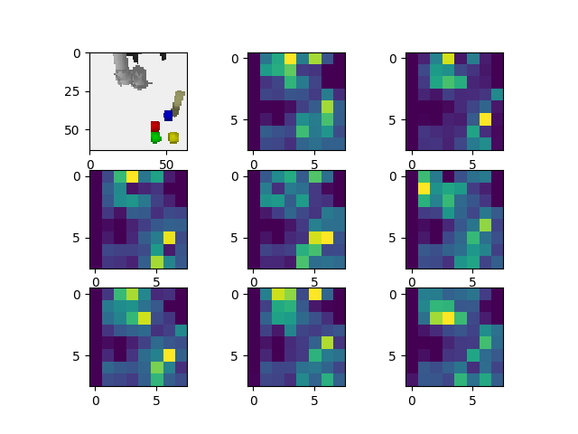
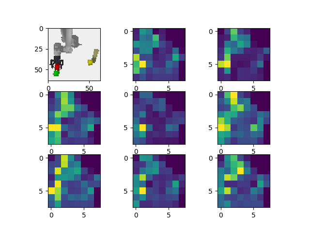

# Experiments and Training Notes for Task Learning

This document is for experiments from 2018-01-05. 

## Learning

### Example Training Command

This contains some examples of commands you can run on different data sets.

#### Pretrain Encoders

#### Conditional Images

```
# Start training
rosrun costar_models ctp_model_tool --model conditional_image --data_file data.h5f --lr 0.0001 --dropout_rate 0.2

# Resume training
rosrun costar_models ctp_model_tool --model conditional_image --data_file data.h5f --lr 0.0001 --dropout_rate 0.2 --load_model

# Retrain encoder and decoder end-to-end
rosrun costar_models ctp_model_tool --model conditional_image --data_file data.h5f --lr 0.0001 --dropout_rate 0.2 --retrain
```

### Conditional Image GAN

This version runs the conditional image GAN:

```
rosrun costar_models ctp_model_tool --model conditional_image_gan --data_file data.h5f --lr 0.0002 --dropout_rate 0.2 
```

To train it end-to-end add the `--retrain` flag:
```
# Retrain encoders and decoders with "--retrain"
rosrun costar_models ctp_model_tool --model conditional_image_gan --data_file data.h5f --lr 0.0002 --dropout_rate 0.2 --retrain
```

Different values for dropout rate and for learning rate might be useful.

#### Training Policies

We also learn "actor" networks that operate on the current world state. These are trained with the `ff_regression` and `hierachical` models.

```
# Use the --success_only flag to make sure we don't learn bad things
rosrun costar_models ctp_model_tool --model hierarchical --data_file data.h5f --lr 0.001 --dropout_rate 0.2 --success_only
```

The advantage here is that they can use a little bit more information than the previous versions should it prove necessary. They are also trained end-to-end, since there is no need for them to produce high quality images.

### Husky Experiments

First, you need a data set. Here we assume this was placed in `husky_data`, and consists of numpy blobs.

```
# Set "--features husky" to use husky versions of models
rosrun costar_models ctp_model_tool --model pretrain_image_encoder --features husky --data_file husky_data.npz --lr 0.001 --dropout_rate 0.2
```

Alternately, you can train the GAN version:

```
# Start gan with the pre-collected husky dataset, containing both successes and
# failures.
# Learning rate set to 0.0002 as per "Image to Image Translation..." paper.
rosrun costar_models ctp_model_tool --model pretrain_image_gan --features husky --data_file husky_data.npz --lr 0.0002 --dropout_rate 0.2
```

### Training On MARCC

MARCC is our cluster for machine learning, equipped with a large set of Tesla K80 GPUs. We assume that when training on a cluster like MARCC, you will not want a full ROS workspace, so instead we assume you will install to some path $COSTAR_PLAN and just run scripts.

To run on MARCC, the easiest set up is always:
```
export COSTAR_PLAN=$HOME/costar_plan
$COSTAR_PLAN/slurm/start_ctp_stacks.sh
```

This will run the `$COSTAR_PLAN/slurm/ctp.sh$ script with a few different arguments to start SLURM jobs.


## Validation

### Hidden State

You can visualize the hidden state learned with models like `pretrain_image_encoder`, `pretrain_image_gan`, and `pretrain_sampler` with the `ctp_hidden.py` tool:

```
rosrun costar_models ctp_hidden.py --cpu --model conditional_image --data_file test2.h5f
```

The learned representations come in 8 x 8 x 8 = 512 dimensions by default. This tool is meant to visualize representations that are eight channels or so. This includes some spatial information; take a look at the examples below. You'll see information seems to have some spatial correlation to the original image.



This changes dramatically when we compare to a representation where all the blocks are now on the left:



### Transformation

```
rosrun costar_models ctp_transform.py --cpu --model conditional_image --data_file test2.h5f
```

