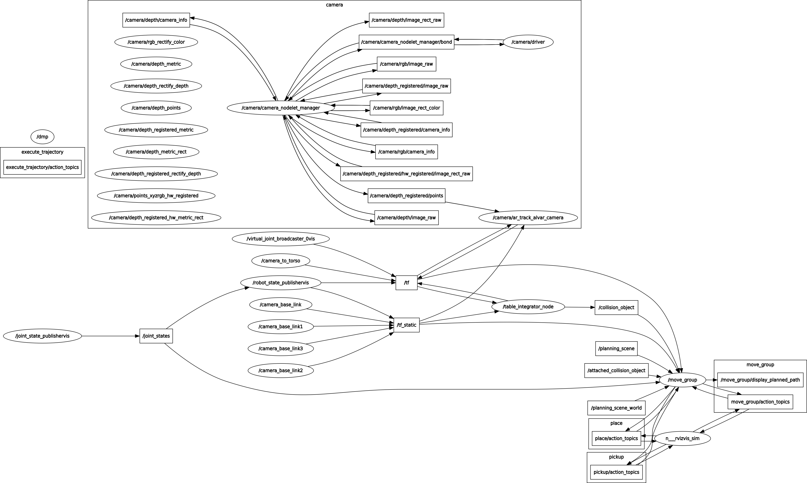

# CTP on the Real TOM robot

## Starting

```
roslaunch ctp_tom planner.launch
```

### Fake (Debugging) Setup

```
roslaunch ctp_tom planner.launch
rosrun ctp_tom fake_objects.py # add some extra oranges to the scene
rosrun ctp_tom parse.py a.bag,b.bag,c.bag --fake --show
```

You can run the `parse.py` script with many different arguments and rosbags. Some examples:

```
parse.py $BAGS --fake # provide fake object detections and compile task
parse.py $BAGS --fake --show # show a graph
parse.py $BAGS --fake --plan # compute a plan
parse.py $BAGS --fake --plan --max_depth $X --iter $Y # change planning params
```

Using these without the `--fake` flag is currently a WIP.

### Execution Setup (Work in progress)

```
export BAGS=a.bag,b.bag,c.bag,d.bag,e.bag
roslaunch ctp_tom planner.launch slave:=true
rosrun ctp_tom parse.py $BAGS --plan --execute
```

## ROS Topics



Key topics:
  - /camera/depth_registered/points
  - /joint_states
  - /collison_object 
  - /tf
  - /camera/depth/camera_info
  - /tf_static

## Components

### The Table Integrator

This script uses the [integrator tool](../costar_task_plan/python/costar_task_plan/robotics/perception/transform_integrator.py) to publish a single frame for the table location in `/camera_rgb_optical_frame`.

The [table_integrator.py](../ctp_tom/scripts/table_integrator.py) script itself just computes a few transforms based on observed data, and is not perfect.

You may wish to change:
  - the rotations and translations between markers. these are all transforms from the marker to `/ar_marker_0`. After this, an offset is applied to push everything into the right frame for the table.
  - the offset. This is what actually computes the location of the table.
  - history length. This is used to get "smooth" estimates of where the table is.

